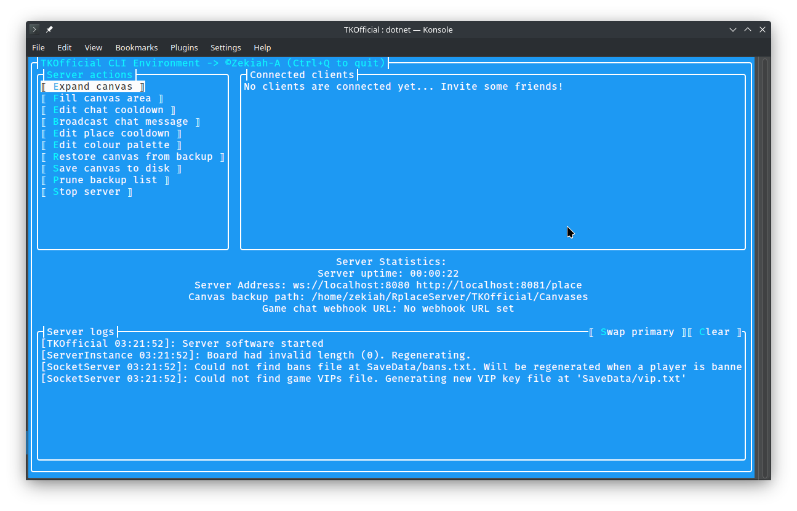

# RplaceServer
This repo hosts a colection of server softwares intended for use with rplace.live.

### What's here:
 - RplaceServer (Library with base rplace server functionality that can be implemented by a server software (not for use independently))
 - TKOfficial (Official CLI server software implementation, for spinning up single canvas/instance servers)
 - HTTPOfficial (Central auth server software for rplace.live, which manages the game's global posts and accounts system (not for use independently))

# RplaceServer
A modular, moddable and scalable server software designed to host rplace.live canvases. Can be used standalone, GUI, or embedded inside of a client in order to allow for easy, no code self hosted game. Modular server library allows for setting up servers, and modifying game mechanics easily.

## TKOfficial
TKOfficial has been created as a terminal-based rplace server software implementation intended for user use.

### Running from binary:

TKOfficial binaries have been provided on the [releases](https://github.com/Zekiah-A/RplaceServer/releases) page, download the appropriate one for your system.

Then, open a terminal, (use Powershell on windows), enter the rplace server directory with `cd Path/To/TKOfficial`

Then run the binary with `./EXECUTABLE NAME`

The first time you run the server, it should create a configuration, edit this in a text editor, and run the server again to apply and start the rplace game server.

### Running from source:
_To run from source, you need the latest dotnet version and git installed on your system._

Clone the repository with `git lfs clone --recursive https://github.com/Zekiah-A/RplaceServer/` to include all submodules.

Once cloned, enter the root RplaceServer directory, with `cd RplaceServer` and ensure all submodules are updated with `git submodule update --remote`

Enter the TKOfficial directory, for example, with `cd TKOfficial`.

Run `dotnet run` to start the server. When running with SSL/on an admin restricted port, you may need to run this command with administrator privileges.

### Project Aims:
 - Open, contributable and easy to use
 - Faster than bunJS server
 - Moddable and easily extendable
 - Daemonisable
 - Linux shell scripts such as used in board shrinking made cross platform and built in
 - Library makes use of events and abstract methods to allow customisation of server functions
 - Compatible with both GUI, and CLI
 - Decoupled unlike bunJS server, abstracted and simplified
 - Scalable

## Plugins:
### Events:
 - Events are distributed after an action is accepted, but before the server processes it. For example, when a pixel is placed, server will send out PixelPlacementReceived event, only after it has confirmed that pixel placement has been done after the cooldown period, or the IP has passed the banned checks, etc. If a packet is rejected before the server has handled it, no event will be called.
 - As events such as PixelPlacementReceived are called before the server has handled it (such as before the server has sent out the pixel and applied it to the canvas), by inhibiting the event from continuing in an event handler, the (for example) pixel placement will never go through.
 - Events with past tense names, such as CanvasBackupCreated, PlayerConnected and PlayerDisonnected are handled beforehand, and are uninhibitable alert-only events.
